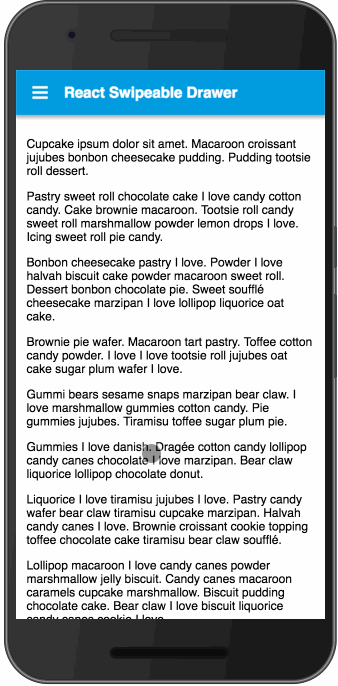

<div align="center">
<h1>react-swipeable-drawer</h1>
 
<strong>A swipeable drawer for the mobile web</strong>
</div>
 
<hr />
 
[![Build Status][build-badge]][build]
[![Code Coverage][coverage-badge]][coverage]
[![downloads][downloads-badge]][npmcharts]
[![version][version-badge]][package]
[![MIT License][license-badge]][LICENSE]

[](#contributors)
[![PRs Welcome][prs-badge]][prs]
[![Code of Conduct][coc-badge]][coc]

[![size][size-badge]][unpkg-dist]
[![gzip size][gzip-badge]][unpkg-dist]
[![module formats: umd, cjs, and es][module-formats-badge]][unpkg-dist]

[![Watch on GitHub][github-watch-badge]][github-watch]
[![Star on GitHub][github-star-badge]][github-star]
[![Tweet][twitter-badge]][twitter]
 
## The problem
 
Every time I see a hamburger menu and a drawer, I try to swipe it open.
 
## This solution
 
A tiny react library, with no dependencies, that relies mostly on css transforms.



 
## Installation
 
This module is distributed via [npm][npm] which is bundled with [node][node] and
should be installed as one of your project's `dependencies`:
 
```
npm install --save react-swipeable-drawer
```
 
> This package also depends on `react` and `prop-types`. Please make sure you have
> those installed as well.
 
## Usage

See the complete [example](./examples).
 
Wrap your `MainContent` component in the `Drawer` component:

```jsx
import Drawer from "react-swipeable-drawer";

import DrawerContent from "./DrawerContent";
import MainContent from "./MainContent";

const App = () => (
  <Drawer width={80} content={<DrawerContent />}>
    <MainContent />
  </Drawer>
);

export default App;
```

In your `MainContent` component, use the `style` and `toggleDrawer` props:

```jsx
const MainContent = ({ style, toggleDrawer }) => (
  // It is very important to apply the style prop to your content,
  // otherwise it will still be able to scroll when the drawer is open
  <div className="App" style={{ ...style }}>
    You main content goes here...
    <button onClick={toggleDrawer}>Toggle Drawer</button>
  </div>
)

export default MainContent;
```

### Props

  - `width` (integer): width in percent (%) of the drawer
  - `content` (component): a react component with the content of your drawer

## Known limitations

Due to the fact that Safari on iOS interprets a swipe from the left as a navigation to the previous page, you will not be able to swipe the drawer open. The `toggleDrawer` function should still work though.

## Other Solutions
 
- [`react-motion-drawer`](https://github.com/stoeffel/react-motion-drawer)
- [`react-drawer`](https://github.com/atom2ueki/react-drawer)
- [`react-md navigation-drawers`](https://react-md.mlaursen.com/components/navigation-drawers)
 
## Contributors
 
Thanks goes to these people ([emoji key][emojis]):
 
<!-- ALL-CONTRIBUTORS-LIST:START - Do not remove or modify this section -->
| [<br /><sub>Damien Varron</sub>](https://github.com/damusnet)<br />[💻](https://github.com/damusnet/react-swipeable-drawer/commits?author=damusnet "Code") [📖](https://github.com/damusnet/react-swipeable-drawer/commits?author=damusnet "Documentation") [🚇](#infra-damusnet "Infrastructure (Hosting, Build-Tools, etc)") [⚠️](https://github.com/damusnet/react-swipeable-drawer/commits?author=damusnet "Tests") [🤔](#ideas-damusnet "Ideas, Planning, & Feedback") [🔧](#tool-damusnet "Tools") |
| :---: |
<!-- ALL-CONTRIBUTORS-LIST:END -->
 
This project follows the [all-contributors][all-contributors] specification.
Contributions of any kind welcome!

Many thanks also to [Kent C. Dodds](http://kentcdodds.com/) from whom I stole the template for this repo and the build process.
 
## LICENSE
 
MIT
 
[npm]: https://www.npmjs.com/
[node]: https://nodejs.org
[build-badge]: https://img.shields.io/travis/damusnet/react-swipeable-drawer.svg?style=flat-square
[build]: https://travis-ci.org/damusnet/react-swipeable-drawer
[coverage-badge]: https://img.shields.io/codecov/c/github/damusnet/react-swipeable-drawer.svg?style=flat-square
[coverage]: https://codecov.io/github/damusnet/react-swipeable-drawer
[version-badge]: https://img.shields.io/npm/v/react-swipeable-drawer.svg?style=flat-square
[package]: https://www.npmjs.com/package/react-swipeable-drawer
[downloads-badge]: https://img.shields.io/npm/dm/react-swipeable-drawer.svg?style=flat-square
[npmcharts]: http://npmcharts.com/compare/react-swipeable-drawer
[license-badge]: https://img.shields.io/npm/l/react-swipeable-drawer.svg?style=flat-square
[license]: https://github.com/damusnet/react-swipeable-drawer/blob/master/LICENSE
[prs-badge]: https://img.shields.io/badge/PRs-welcome-brightgreen.svg?style=flat-square
[prs]: http://makeapullrequest.com
[donate-badge]: https://img.shields.io/badge/$-support-green.svg?style=flat-square
[coc-badge]: https://img.shields.io/badge/code%20of-conduct-ff69b4.svg?style=flat-square
[coc]: https://github.com/damusnet/react-swipeable-drawer/blob/master/other/CODE_OF_CONDUCT.md
[github-watch-badge]: https://img.shields.io/github/watchers/damusnet/react-swipeable-drawer.svg?style=social
[github-watch]: https://github.com/damusnet/react-swipeable-drawer/watchers
[github-star-badge]: https://img.shields.io/github/stars/damusnet/react-swipeable-drawer.svg?style=social
[github-star]: https://github.com/damusnet/react-swipeable-drawer/stargazers
[twitter]: https://twitter.com/intent/tweet?text=Check%20out%20react-swipeable-drawer!%20https://github.com/damusnet/react-swipeable-drawer%20%F0%9F%91%8D
[twitter-badge]: https://img.shields.io/twitter/url/https/github.com/damusnet/react-swipeable-drawer.svg?style=social
[emojis]: https://github.com/kentcdodds/all-contributors#emoji-key
[all-contributors]: https://github.com/kentcdodds/all-contributors
[gzip-badge]: http://img.badgesize.io/https://unpkg.com/react-swipeable-drawer/dist/react-swipeable-drawer.umd.min.js?compression=gzip&label=gzip%20size&style=flat-square
[size-badge]: http://img.badgesize.io/https://unpkg.com/react-swipeable-drawer/dist/react-swipeable-drawer.umd.min.js?label=size&style=flat-square
[unpkg-dist]: https://unpkg.com/react-swipeable-drawer/dist/
[module-formats-badge]: https://img.shields.io/badge/module%20formats-umd%2C%20cjs%2C%20es-green.svg?style=flat-square
